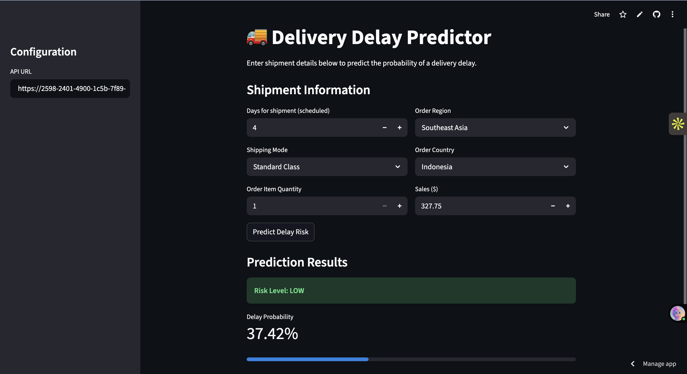

# Delivery Delay Prediction API

A production-ready machine learning API that predicts delivery delays in logistics operations **before shipment dispatch**, enabling proactive decision-making to reduce late deliveries.

## Features

- **Pre-dispatch prediction** - Uses only information available at shipment dispatch (no data leakage)
- **REST API** - FastAPI-based service with interactive documentation
- **Production-ready** - Trained model with 69.65% accuracy, 84.89% precision
- **Risk categorization** - LOW, MEDIUM, HIGH risk levels for easy interpretation
- **Explainable** - Logistic Regression model for interpretable insights

## Quick Start

### Prerequisites

- Python 3.8+
- pip

### Installation

```bash
# Clone repository
git clone https://github.com/Rishavv007/delivery-delay-prediction-system.git
cd delivery-delay-prediction-system

# Install dependencies
pip install -r requirements.txt
```

### Training

```bash
# Place dataset at data/DataCoSupplyChainDataset.csv
python -m src.train
```

### Running the API

```bash
uvicorn api.main:app --host 0.0.0.0 --port 8000
```

API available at: `http://localhost:8000`

Interactive docs: `http://localhost:8000/docs`

## Streamlit Dashboard



A user-friendly web interface to interact with the prediction API without writing code.

### Running the Dashboard

1. **Start the API server first**:
   ```bash
   uvicorn api.main:app --host 0.0.0.0 --port 8000
   ```

2. **Open a new terminal and start Streamlit**:
   ```bash
   streamlit run app.py
   ```

3. **Access the dashboard**: `http://localhost:8501`

### Running with a Public Tunnel (ngrok)

To access your local API from a deployed Streamlit dashboard (e.g., Streamlit Cloud):

1. **Install and run ngrok**:
   ```bash
   brew install ngrok  # If not installed
   ngrok http 8000
   ```
2. **Copy the public forwarding URL** (e.g., `https://xxxx.ngrok-free.app`).
3. **Paste the URL** into the "API URL" box in the dashboard's sidebar.

## API Usage

### Predict Delivery Delay

```bash
curl -X POST "http://localhost:8000/predict" \
  -H "Content-Type: application/json" \
  -d '{
    "Days for shipment (scheduled)": 4,
    "Shipping Mode": "Standard Class",
    "Order Region": "Southeast Asia",
    "Order Country": "Indonesia",
    "Order Item Quantity": 1,
    "Sales": 327.75
  }'
```

**Response:**
```json
{
  "delay_probability": 0.3645,
  "risk_level": "LOW"
}
```

### Risk Levels

- **HIGH**: probability ≥ 0.7
- **MEDIUM**: 0.4 ≤ probability < 0.7
- **LOW**: probability < 0.4

## Model Performance

- **Accuracy**: 69.65%
- **Precision**: 84.89%
- **Recall**: 54.33%
- **F1-Score**: 66.25%

## Features Used

- Days for shipment (scheduled)
- Shipping Mode
- Order Region
- Order Country
- Order Item Quantity
- Sales

## Project Structure

```
delivery-delay-predictor/
├── src/          # Source code (preprocessing, model, training)
├── api/          # FastAPI service
├── models/       # Trained model (generated after training)
├── data/         # Dataset (not included)
└── requirements.txt
```

## License

MIT License
